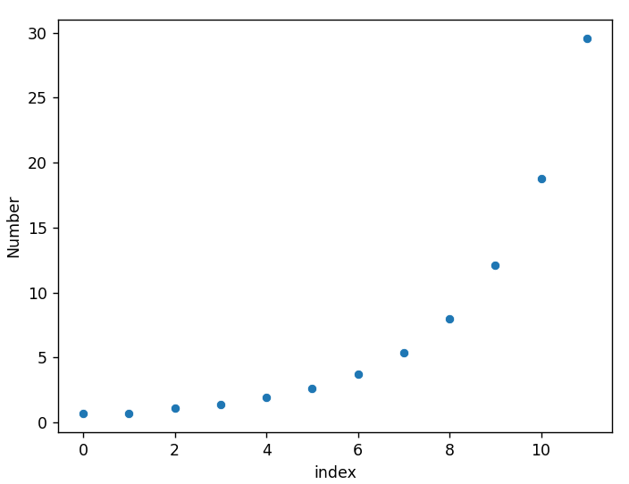

# levine-sequence
The script `levine_sequence.py` generates the [Levine sequence](https://www.youtube.com/watch?v=KNjPPFyEeLo). 

output: `[2, 2, 3, 4, 7, 14, 42, 213, 2837, 175450, 139759600, 6837625106787]`

logarithmic sequence: `[0.6931471805599453, 0.6931471805599453, 1.0986122886681098, 1.3862943611198906, 1.9459101490553132, 2.6390573296152584, 3.7376696182833684, 5.3612921657094255, 7.950502434808851, 12.07510938101136, 18.755434361736754, 29.55346158066275]`

# Seaborn plot
The following is a plot of the log of the first twelve numbers in the Levine sequence: 

